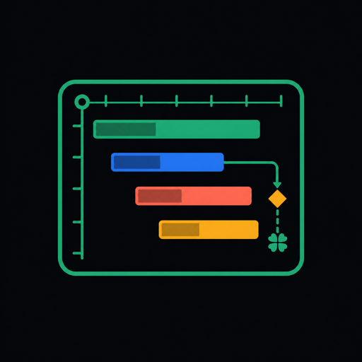

<p align="center">
  
</p>

<h1 align="center">Yotsuba Gantt for Flutter</h1>

<p align="center">
  <a href="https://pub.dev/packages/yotsuba_gantt"></a>
  <a href="https://github.com/isla4ever/yotsuba-gantt-flutter/actions/workflows/ci.yml"></a>
  <a href="LICENSE"></a>
</p>

这是 `yotsuba_gantt` 的 Flutter 包源码仓库，同时包含一个公开的 Android 演示应用。演示应用位于 [`example/`](example/)，故意通过 pub.dev 的 hosted dependency 接入已发布包，用来验证真实消费者体验；包本身是原生 Widget，不使用 WebView。

- 原生 `ListView.builder` 行虚拟化，10,000 条任务示例可直接运行。
- 六档时间维度、密集数据自动定位、任务拖动与时间吸附。
- 任务依赖、进度层、里程碑、边界快速跳转与日期范围控制。
- 多个图表可独立运行，也可通过 `YgGanttLinkGroup` 同步滚动和维度。
- Task Bar、任务表、边界入口和入场动画均提供 Builder。

## 演示应用与 Android APK

```bash
cd example
flutter pub get
flutter run
```

`example/pubspec.yaml` 精确安装 `yotsuba_gantt: 0.1.0-alpha.1`，不会通过本地 `path` 依赖掩盖 pub.dev 安装问题。发布工作流还会核对 APK 实际解析到的包版本，避免演示应用误打入旧包。每个 Flutter Release 都附带 APK 与 SHA-256 校验文件：

- [下载最新 Android Release](https://github.com/isla4ever/yotsuba-gantt-flutter/releases)
- [查看演示源码](example/)

## 安装

```yaml
dependencies:
  yotsuba_gantt: ^0.1.0-alpha.1
```

## 最小示例

```dart
import 'package:flutter/material.dart';
import 'package:yotsuba_gantt/yotsuba_gantt.dart';

final tasks = <YgTask>[
  YgTask(
    id: 'design',
    title: '交互设计',
    owner: '小叶',
    start: DateTime(2026, 8, 3),
    end: DateTime(2026, 8, 12),
    progress: .68,
    barStyle: YgBarStyle.progress,
  ),
  YgTask(
    id: 'release',
    title: 'Alpha 发布',
    start: DateTime(2026, 8, 14),
    end: DateTime(2026, 8, 14),
    kind: YgTaskKind.milestone,
    dependencies: const ['design'],
  ),
];

YotsubaGantt(
  tasks: tasks,
  viewMode: YgViewMode.week,
  autoFocus: YgAutoFocus.dense,
  onTaskChanged: (change) {
    // 使用 change.task 更新你的状态管理或后端。
  },
  onTaskDoubleTap: (task) {
    // 打开自己的编辑 Dialog。
  },
)
```

## 日期范围与维度

`rangeStart` / `rangeEnd` 接收任意 `DateTime`。日期选择 UI 由宿主决定，示例项目展示了 Material `showDateRangePicker` 的完整接法。

```dart
YotsubaGantt(
  tasks: tasks,
  rangeStart: selectedRange.start,
  rangeEnd: selectedRange.end,
  viewMode: viewMode,
  onViewModeChanged: (next) => setState(() => viewMode = next),
)
```

六档维度：`year`、`quarter`、`month`、`week`、`day`、`hour`。拖动与缩放会按当前维度的默认时间单位吸附。

## 控制器

```dart
final controller = YgGanttController();

await controller.scrollToDate(DateTime.now());
await controller.scrollTaskIntoView('release');
await controller.scrollToRow(2400);
controller.setView(YgViewMode.month);
await controller.fitToTasks();
```

## 多图联动

同一页面内的图表默认互不影响。为需要联动的图表传入同一个 `YgGanttLinkGroup`，并选择同步范围：

```dart
final group = YgGanttLinkGroup();

YotsubaGantt(
  tasks: productTasks,
  linkGroup: group,
  syncMode: YgSyncMode.all,
)

YotsubaGantt(
  tasks: deliveryTasks,
  linkGroup: group,
  syncMode: YgSyncMode.all,
)
```

`YgSyncMode` 支持 `none`、`scroll`、`view`、`all`。联动更新携带来源标识，不会回环广播。

## 大数据与虚拟化

- 左侧任务列表和右侧时间轴都使用 `ListView.builder`，只构建可见行。
- 网格与时间表头由 `CustomPainter` 批量绘制，不为每个单元格创建 Widget。
- 依赖线只绘制当前视口附近的关系。
- 任务 ID 索引只在数据源变化时重建，滚动绘制不会扫描 10,000 条任务。
- `onVisibleRangeChanged` 可用于远程分页、游标或窗口数据加载。
- 默认入场动画只作用于新进入视口的少量行，可通过 `entryTransition: YgEntryTransition.none` 关闭。

## 自定义

- `taskBarBuilder`：完整替换任务条内容。
- `rowHeaderBuilder`：完整替换左侧任务行。
- `entryTransitionBuilder`：自定义虚拟行进入视口的过渡。
- `edgeIndicatorBuilder`：替换每一行贴边的视口外任务入口。
- `YgGanttThemeData`：颜色、字体、行高、任务高度和圆角。
- `YgTask.metadata`：携带业务字段，不侵入组件数据模型。

完整可运行示例见 [`example/lib/main.dart`](example/lib/main.dart)。

- [Flutter 独立仓库与 Android Release](https://github.com/isla4ever/yotsuba-gantt-flutter)
- [Vue / React / Core 主仓库](https://github.com/isla4ever/yotsuba-gantt)
- [完整中文文档](https://isla4ever.github.io/yotsuba-gantt/)
